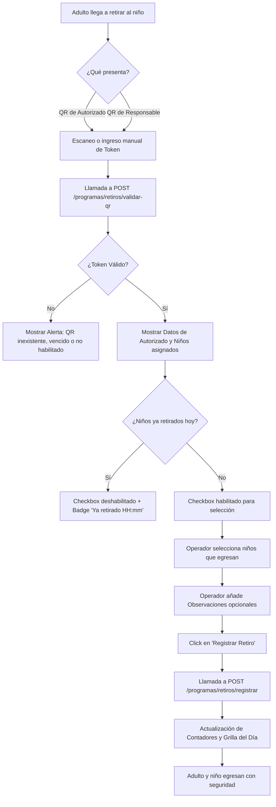
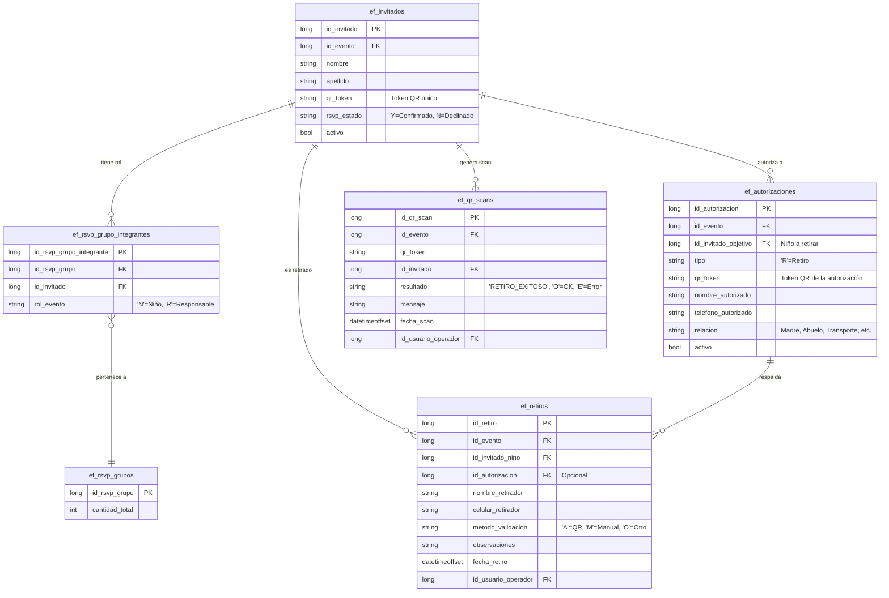

# Eventia — Eventos de Cumpleaños Infantiles
## CIRCUITO Y FUNCIONAMIENTO DE RETIRO POR QR EN CUMPLEAÑOS INFANTILES

Este documento detalla el funcionamiento del módulo de **Retiro de Niños por QR** en eventos de cumpleaños infantiles dentro de la plataforma Eventia. Abarca desde la lógica de negocio y el flujo de usuario en el frontend hasta las especificaciones técnicas del backend, base de datos y endpoints involucrados, con énfasis en la variación de eventos tipo “Cumpleaños”.

---

> [!NOTE]
> El objetivo principal de este módulo es garantizar la seguridad física de los menores asistentes al evento, validando mediante códigos QR quién está autorizado a retirarlos, controlando duplicidades y registrando un historial audible de las salidas diarias.

---

## 1. Conceptos Claves y Reglas de Negocio

El sistema gestiona la entrega de los menores basándose en las siguientes entidades:

1. **Participantes (Niños - Rol `N`)**: Son los menores inscriptos en el programa. Cada uno tiene asignado un código QR único (`qr_token`) generado al confirmar su inscripción.
2. **Responsables (Padres/Tutores - Rol `R`)**: Adultos a cargo del grupo familiar. También disponen de un código QR propio que representa a todo el grupo familiar.
3. **Autorizados de Retiro (`ef_autorizaciones` tipo `R`)**: Personas explícitamente autorizadas por los responsables para retirar a un niño. Cada autorización tiene un token único (`qr_token`) para lectura directa, además del nombre, celular, parentesco (relación) y estado activo/inactivo.
4. **Operador (Staff/Portero)**: Usuario de la plataforma (ej. monitor, coordinador o portero) que utiliza el panel de retiros en una tablet o smartphone para escanear y validar las salidas.

### Reglas Críticas de Negocio
* **Doble Tipo de Lectura**: Un operador puede escanear el QR de un **Responsable (Rol `R`)** (lo que lista todos los niños del grupo) o el QR de una **Autorización específica** (que habilita el retiro de los niños asignados).
* **Validación de Identidad**: El backend exige que el nombre del retirador físico coincida de manera exacta (case-insensitive) con alguno de los autorizados activos en el sistema para ese niño.
* **Control de Retiros Duplicados**: Un niño no puede ser retirado dos veces el mismo día. Si ya fue retirado hoy, el sistema deshabilita su selección en la UI y muestra la hora exacta del retiro anterior.
* **Trazabilidad Absoluta**: Cada escaneo (exitoso o fallido) queda registrado en `ef_qr_scans`, y cada retiro exitoso se guarda de forma inmutable en `ef_retiros`.
  
---

### Retiro por QR en Eventos de Cumpleaños Infantiles

En los eventos de cumpleaños infantiles la lógica de retiro por QR es idéntica al flujo general, pero se aplican las siguientes consideraciones:
- Los niños se agrupan bajo un `eventoTipo = 'Cumpleaños'`.
- El token QR del responsable se genera al crear el evento y se envía a los padres.
- El backend verifica que el `id_evento` pertenezca a un programa de tipo `Cumpleaños` antes de validar.
- Se permite que el responsable (rol `R`) autorice a terceros mediante la tabla `ef_autorizaciones` al igual que en colonias.
- El reporte diario se filtra por `tipoEvento = 'Cumpleaños'`.

Esta información complementa el flujo general y asegura que los operarios de puerta manejen correctamente los retiros en fiestas infantiles.
---

## 2. Ciclo de Vida y Creación de Autorizaciones

Las autorizaciones (`ef_autorizaciones`) con tipo `"R"` (Retiro) pueden crearse y guardarse en el sistema a través de dos canales principales con flujos y reglas bien definidos en el backend ([AutorizacionesService.cs](file:///c:/Desarrollo/Eventia/CodigoFuente/antenas/API/Services/Autorizacion/AutorizacionesService.cs)):

### A. Canal del Responsable Familiar (Enlace RSVP Personal)
Este es el flujo de autoservicio para que los padres o tutores deleguen la recogida del menor de forma anticipada.
1. **Acceso**: El responsable de la familia accede a su **Enlace Personal RSVP** (`rsvp_token`) enviado por Eventia al momento de la inscripción.
2. **Formulario de Autorizados**: En el formulario público de inscripción/actualización de datos familiares, el responsable puede añadir un nuevo portador autorizado de retiros ingresando su **Nombre completo, celular y parentesco (relación)**.
3. **Guardado en el Backend (`CreateFromPersonalLinkAsync`)**:
   * Al enviar el formulario, el cliente web realiza una llamada a `POST /autorizacion/p/{rsvpToken}/autorizaciones`.
   * El backend valida que el portador del token sea el **titular del grupo** y que tenga asignado el rol **Responsable (`R`)** en la tabla `ef_rsvp_grupo_integrantes`. *Solo los responsables familiares tienen permisos para añadir autorizaciones*.
   * El backend busca a **todos los menores (Rol `N`)** que pertenecen a ese mismo grupo familiar (`id_rsvp_grupo`).
   * Normaliza el número de celular del autorizado al formato internacional estándar E.164.
   * **Multi-guardado automático**: El sistema crea y añade un registro en la tabla `ef_autorizaciones` **para cada uno de los niños del grupo familiar** de forma simultánea. De este modo, al autorizar a una persona (por ejemplo, el abuelo o chofer del transporte escolar), se autoriza su retiro para todos los hermanos de la casa de forma automática.
   * Cada registro se guarda con `activo = true`, `tipo = "R"`, `fecha_alta = DateTimeOffset.UtcNow` y con su respectivo `qr_token` generado automáticamente.

### B. Canal del Operador / Coordinador (Panel de Administración / Backoffice)
Este es el flujo interno en el que un operador administrativo de la colonia o evento asiste manualmente al tutor en las oficinas o por reclamo telefónico.
1. **Acceso**: El operador busca al inscripto en la sección de **Gestión de Inscripciones** $\rightarrow$ **Detalle de Inscripto** o panel de **Autorizaciones**.
2. **Formulario de Alta**: Haz clic en "Agregar Autorizado" e introduce los campos necesarios para un participante niño específico.
3. **Guardado en el Backend (`CreateAsync`)**:
   * El panel realiza una llamada a `POST /autorizacion` pasando el `idEvento` del contexto.
   * El backend verifica que el participante objetivo (`id_invitado_objetivo`) exista y pertenezca al evento especificado.
   * Se inserta un único registro en la tabla `ef_autorizaciones` asociado al menor en cuestión con `activo = true` y `fecha_alta = DateTimeOffset.UtcNow`.

### Modificación, Desactivación y Baja
* **Modificación**: Si el operador o responsable actualiza datos de un autorizado (ej. corrige el teléfono o nombre), se ejecuta `UpdateAsync` (`PUT /autorizacion/{idAutorizacion}`), validando y guardando los cambios sobre la marcha.
* **Desactivación (Baja)**: Para revocar una autorización, se realiza una llamada a `DisableAsync` (`DELETE /autorizacion/{idAutorizacion}`). El backend no borra físicamente la fila para conservar el histórico, sino que establece `activo = false` y guarda la `fecha_baja = DateTimeOffset.UtcNow`. Esto inhabilita el token QR inmediatamente en puerta.

---

## 3. Flujo del Proceso (Paso a Paso)

El siguiente diagrama de flujo ilustra la secuencia desde que el adulto llega a la puerta del predio hasta que se registra la salida:



### Detalle de las Etapas:

1. **Lectura del QR**: El operador en puerta abre el módulo **Retiros** de Eventia. Puede usar la cámara de su dispositivo para escanear el código QR que porta el adulto, o bien tipear manualmente el código alfanumérico (token) en caso de fallos de lectura.
2. **Validación Automática**: Al validar, el sistema consulta al backend. Este verifica el token en la base de datos, confirma que esté activo y devuelve quién es el portador autorizado, su teléfono, su relación familiar y la lista de niños asociados.
3. **Selección y Control**: La pantalla muestra tarjetas bien identificadas con los nombres de los menores. Si un hermano del grupo familiar ya fue retirado antes (por ejemplo, al mediodía), su ficha aparece bloqueada con la etiqueta "Ya retirado". El operador tilda únicamente a los niños que se van en ese momento.
4. **Registro**: Se confirman las salidas. El sistema guarda la fecha/hora UTC exacta, el nombre del operador que autorizó el egreso y cualquier observación pertinente (ej. "Retirado por puerta lateral de emergencia", "Se retira con mochila verde").
5. **Historial del Día**: Inmediatamente, la grilla de retiros del día se actualiza, permitiendo al coordinador tener visibilidad en tiempo real de cuántos niños siguen en el predio y cuántos ya egresaron.

---

## 4. Arquitectura Técnica de Base de Datos

Las tablas involucradas en el backend (C# con PostgreSQL / SQL Server) y sus campos principales son:



---

## 5. Referencia de la API (Endpoints)

El circuito se apoya en tres endpoints principales definidos en `programasRetirosController.cs` y consumidos en el frontend mediante proxies de Next.js.

### 5.1 Validar Código QR de Retiro
* **Ruta**: `POST /programas/retiros/validar-qr`
* **Descripción**: Verifica la validez de un token QR. Retorna el adulto autorizado y el listado de niños que tiene permitido retirar, especificando si ya salieron hoy.
* **Cuerpo de la Petición (`Request`)**:
```json
{
  "qrToken": "f9d17bdd65c4df5ef48e78fd7291cadafba7f5669a49fffcf6a0f64208a8fbcb",
  "fechaOperativa": "2026-06-24"
}
```
* **Respuesta Exitosa (`Response - 200 OK`)**:
```json
{
  "valido": true,
  "mensaje": "QR válido.",
  "idEvento": 34,
  "nombreAutorizado": "Carla Domenech",
  "telefonoAutorizado": "+34600999111",
  "relacion": "Madre",
  "qrToken": "f9d17bdd65c4df5ef48e78fd7291cadafba7f5669a49fffcf6a0f64208a8fbcb",
  "participantesAutorizados": [
    {
      "idInvitado": 116,
      "idAutorizacion": 7,
      "nombreCompleto": "Bruno Domenech",
      "yaRetiradoHoy": false,
      "fechaRetiro": null
    },
    {
      "idInvitado": 117,
      "idAutorizacion": 9,
      "nombreCompleto": "Sofia Domenech",
      "yaRetiradoHoy": true,
      "fechaRetiro": "2026-06-24T15:30:00Z"
    }
  ]
}
```

---

### 5.2 Registrar Retiro de Menores
* **Ruta**: `POST /programas/retiros/registrar`
* **Descripción**: Registra la salida física de uno o más niños, respaldada por la autorización leída.
* **Cuerpo de la Petición (`Request`)**:
```json
{
  "qrToken": "f9d17bdd65c4df5ef48e78fd7291cadafba7f5669a49fffcf6a0f64208a8fbcb",
  "fechaOperativa": "2026-06-24",
  "idsInvitadosNinos": [116],
  "observaciones": "Retirado en puerta principal. Todo en orden."
}
```
* **Respuesta Exitosa (`Response - 200 OK`)**:
```json
{
  "ok": true,
  "mensaje": "Retiro registrado correctamente.",
  "fechaOperativa": "2026-06-24",
  "retiros": [
    {
      "idRetiro": 89,
      "idInvitado": 116,
      "participante": "Bruno Domenech",
      "nombreRetirador": "Carla Domenech",
      "fechaRetiro": "2026-06-24T18:42:01.054Z"
    }
  ]
}
```

---

### 5.3 Obtener Retiros del Día (Historial diario)
* **Ruta**: `GET /programas/{idEvento}/retiros/dia?fecha=YYYY-MM-DD`
* **Descripción**: Devuelve un listado completo con la información de todos los menores retirados durante la fecha indicada, utilizado para poblar la grilla de control y los paneles estadísticos.
* **Respuesta Exitosa (`Response - 200 OK`)**:
```json
{
  "idEvento": 34,
  "fecha": "2026-06-24",
  "totalRetiros": 2,
  "items": [
    {
      "idRetiro": 88,
      "idInvitado": 117,
      "participante": "Sofia Domenech",
      "nombreRetirador": "Carla Domenech",
      "telefonoRetirador": "+34600999111",
      "metodoValidacion": "A",
      "observaciones": "Retiro al mediodía",
      "fechaRetiro": "2026-06-24T15:30:00Z"
    },
    {
      "idRetiro": 89,
      "idInvitado": 116,
      "participante": "Bruno Domenech",
      "nombreRetirador": "Carla Domenech",
      "telefonoRetirador": "+34600999111",
      "metodoValidacion": "A",
      "observaciones": "Retirado en puerta principal. Todo en orden.",
      "fechaRetiro": "2026-06-24T18:42:01Z"
    }
  ]
}
```

> [!TIP]
> En la grilla visual, el campo `metodoValidacion` debe traducirse amigablemente al operador:
> * `A` $\rightarrow$ **QR Autorizado** (Badge Verde)
> * `M` $\rightarrow$ **Manual** (Badge Amarillo)
> * `O` $\rightarrow$ **Otro** (Badge Gris)

---

## 6. Estructura de Archivos del Módulo

La implementación del módulo de retiros en la aplicación web reactiva se estructuró con base en la arquitectura modular de Eventia:

* **Modelos y Tipos**: Configurados en `features/programas/types.ts`.
* **Consumo de Servicios**: Ubicado en `features/programas/programas.service.ts`.
* **Proxies de API**: Creados bajo la estructura de carpetas Next.js de la API de backend:
  * Proxy de listado diario: `GET /api/programas/[idEvento]/retiros/dia/route.ts`
  * Proxy de validación: `POST /api/programas/[idEvento]/retiros/validar-qr/route.ts`
  * Proxy de registro: `POST /api/programas/[idEvento]/retiros/registrar/route.ts`
* **Vistas y Componentes Reutilizables**:
  * Página principal del dashboard: `dashboard/events/[id]/inscripciones/retiros/page.tsx` (Orquesta el filtro de fecha, el lector, las métricas y la grilla).
  * `ValidarQRPanel`: Administra la entrada manual/cámara del QR Token.
  * `RegistrarRetiroDrawer`: Lateral dinámico que emerge al escanear un QR válido para seleccionar niños e ingresar notas.
  * `RetirosSummaryCard` y `RetirosGrid`: Encargados de reflejar el estado actual del día en puerta.
