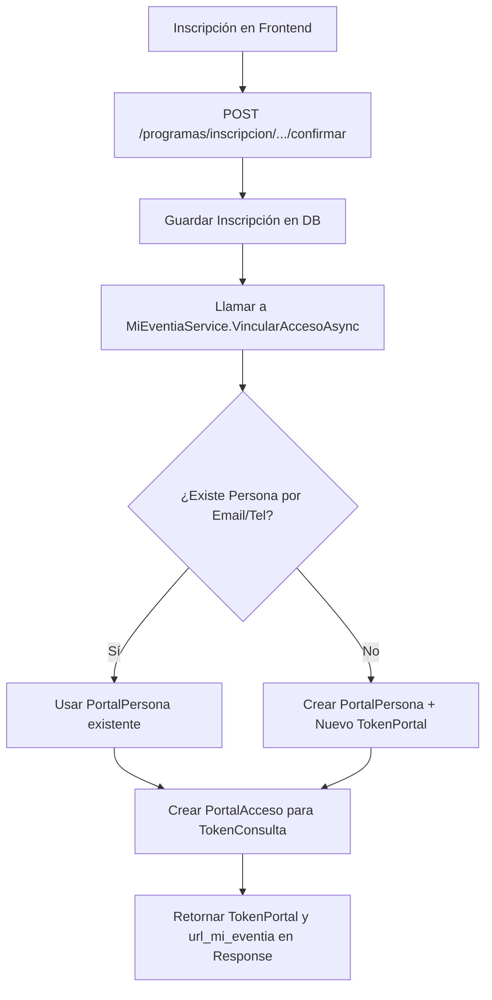

# Documentación Técnica: Portales de Gestión y Dashboard Persistente (Mi-Eventia)

Este documento centraliza y unifica toda la especificación técnica de la arquitectura de portales de participantes: el **Portal Puntual** (con su mecanismo de doble verificación o Soft Verification) y el **Portal Persistente** (**Mi-Eventia**). Sirve como única fuente de verdad tanto para el backend (esquemas de base de datos, servicios, DTOs y lógica) como para el frontend (flujos, guías de integración y contratos de payloads).

---

## Índice
1. [Visión General](#visión-general)
2. [Arquitectura y Modelo de Datos (DB)](#arquitectura-y-modelo-de-datos-db)
3. [Lógica de Negocio y Configuración Backend](#lógica-de-negocio-y-configuración-backend)
4. [Flujos Principales de Operación](#flujos-principales-de-operación)
5. [Endpoints Detallados (Payloads JSON Completos)](#endpoints-detallados-payloads-json-completos)
6. [Guía de Integración para el Frontend](#guía-de-integración-para-el-frontend)
7. [Consideraciones de Seguridad](#consideraciones-de-seguridad)
8. [Migraciones y Pruebas](#migraciones-y-pruebas)

---

## Visión General {#visión-general}
El ecosistema de participantes en Eventia se divide en dos portales web:
1. **Portal Puntual** (`/portal/{token}`): Acceso específico a un evento o programa individual. Cuenta con una parte pública y secciones sensibles protegidas por un flujo de doble verificación suave (Soft Verification).
2. **Portal Persistente (Mi-Eventia)** (`/mi-eventia/{tokenPortal}`): Dashboard unificado que agrupa todos los accesos (`token_consulta`) de una misma persona física (identificada por email o teléfono). Permite al usuario acceder a todos sus eventos de forma persistente y centralizada, sin repetir la verificación por email para cada uno de ellos.

---

## Arquitectura y Modelo de Datos (DB) {#arquitectura-y-modelo-de-datos-db}
Para dar soporte a la vinculación y persistencia de accesos, se crearon tres tablas en el esquema `public` de la base de datos PostgreSQL:

| Entidad | Tabla (PostgreSQL) | Campos Clave | Descripción |
| :--- | :--- | :--- | :--- |
| **`PortalPersona`** | `portal_persona` | `IdPortalPersona` (PK, bigint), `TokenPortal` (UUID único), `Nombre` (varchar), `Email` (varchar único), `Telefono` (varchar) | Identidad unificada y dueña de los accesos. |
| **`PortalAcceso`** | `portal_acceso` | `IdPortalAcceso` (PK, bigint), `IdPortalPersona` (FK), `TokenConsulta` (varchar único), `Tipo` (Enum), `IdEvento` (bigint), `IdInscripcion` (bigint) | Enlace N:1 entre la identidad unificada y los distintos accesos puntuales. |
| **`PortalVerificacion`** | `portal_verificacion` | `Id` (PK, bigint), `TokenConsulta` (varchar), `EmailUsado` (varchar), `FechaHora` (timestamptz), `ResultadoOk` (boolean) | Registro de auditoría para los intentos de doble verificación. |

---

## Lógica de Negocio y Configuración Backend {#lógica-de-negocio-y-configuración-backend}

### 1. Configuración de Modelos (`DbContext` y Fluent API)
* **Mapeo:** Definido en `PortalPersonaConfiguration`, `PortalAccesoConfiguration` y `PortalVerificacionConfiguration`. Crea los índices únicos para `Email` en `portal_persona` y para `TokenConsulta` en `portal_acceso`.
* **Compatibilidad InMemory:** En [DataContext.cs](file:///c:/Desarrollo/Eventia/CodigoFuente/antenas/API/DataSchema/DataContext.cs) se implementó un convertidor de valor para los campos de tipo `string[]` (`etiquetas`) condicionado al proveedor de base de datos. Si el proveedor es InMemory (utilizado en testing), se serializa como string para evitar errores del motor de base de datos en memoria, mientras que en PostgreSQL se mantiene el comportamiento nativo `text[]`.

### 2. Servicio de Vinculación (`MiEventiaService`)
Ubicado en [MiEventiaService.cs](file:///c:/Desarrollo/Eventia/CodigoFuente/antenas/API/Services/MiEventiaService.cs), encapsula la lógica de vinculación al finalizar una inscripción:
* **Idempotencia:** Busca si la persona ya existe por su `Email` o `Telefono`. Si no existe, la crea y le asigna un `TokenPortal` (GUID).
* **Vinculación:** Registra un nuevo `PortalAcceso` enlazando el `TokenConsulta` de la inscripción con la persona, evitando duplicados si el token ya estuviera registrado.
* **Retorno:** Devuelve el `TokenPortal` asociado.

---

## Flujos Principales de Operación {#flujos-principales-de-operación}

### Flujo A: Confirmación de Inscripción ( RSVP / Vinculación )


### Flujo B: Doble Verificación (Soft Verification)
1. El usuario entra al portal puntual de un evento `/portal/{token}`.
2. Si intenta ver secciones sensibles (por ejemplo, ficha de salud, autorizaciones, etc.), el Frontend detecta que no tiene un JWT válido para este token.
3. Se despliega un modal solicitando el correo del responsable.
4. El Frontend realiza un `POST /api/portal/{token}/verificar` con el email ingresado.
5. El Backend registra el intento en `PortalVerificacion`. Si coincide con el email de la inscripción, devuelve un JWT firmado válido por 24 horas.
6. El Frontend almacena el JWT en `sessionStorage` y lo envía en el header `Authorization: Bearer <jwt>` para las llamadas al portal.

---

## Endpoints Detallados (Payloads JSON Completos) {#endpoints-detallados-payloads-json-completos}

### 1. Confirmar Inscripción y Vincular a Mi-Eventia
* **Método y Ruta:** `POST /programas/inscripcion/{token}/confirmar`
* **Descripción:** Registra la inscripción familiar definitiva y la vincula con la cuenta persistente del usuario.

#### JSON de Request (Esperado)
```json
{
  "id_idioma": 1,
  "responsable": {
    "nombre": "Juan",
    "apellido": "Pérez",
    "email": "juan.perez@example.com",
    "telefono": "+5491122334455",
    "documento": "12345678",
    "relacion": "Padre/Madre/Tutor",
    "acepta_comunicaciones": true,
    "acepta_promociones": false
  },
  "participantes": [
    {
      "nombre": "Sofía",
      "apellido": "Pérez",
      "fecha_nacimiento": "2015-05-15",
      "documento": "98765432",
      "observaciones": "Alergia leve al polen",
      "periodos": [
        {
          "id_programa_periodo": 101
        }
      ],
      "servicios": [
        {
          "id_programa_servicio": 201,
          "id_programa_periodo": 101,
          "fechas": ["2026-06-01", "2026-06-02"],
          "cantidad": 1,
          "campos_extra": {
            "talle_remera": "M"
          }
        }
      ],
      "restricciones_alimentarias": [
        {
          "id_restriccion_alimentaria": 5,
          "observacion": "Celíaca (intolerancia severa)",
          "severidad": "Alta"
        }
      ],
      "modalidad_retiro": "REQUIERE_AUTORIZADO",
      "autorizados_retiro": [
        {
          "nombre_autorizado": "María Gómez",
          "telefono_autorizado": "+5491199887766",
          "relacion": "Tía",
          "observaciones": "Retira los martes y jueves"
        }
      ],
      "autorizaciones": [
        {
          "id_programa_autorizacion_config": 12,
          "aceptada": true
        }
      ],
      "salud": {
        "tiene_problema_medico": true,
        "problema_medico_detalle": "Asma leve",
        "tiene_alergias_no_alimentarias": false,
        "alergias_no_alimentarias_detalle": null,
        "necesidad_especial": null,
        "cobertura_medica": "OSDE 310",
        "observaciones_familia": "Llevar paf siempre en la mochila",
        "autoriza_emergencia_medica": true,
        "contactos_emergencia": [
          {
            "nombre": "Abuelo Pedro",
            "telefono": "+5491144332211",
            "relacion": "Abuelo",
            "orden": 1
          }
        ],
        "medicaciones": [
          {
            "nombre_medicacion": "Salbutamol",
            "dosis": "2 puffs",
            "frecuencia": "Cada 4 horas si tiene tos",
            "horario": "Demanda",
            "indicaciones": "Usar cámara de inhalación",
            "requiere_autorizacion": true
          }
        ]
      }
    }
  ],
  "autorizaciones_grupo": [
    {
      "id_programa_autorizacion_config": 10,
      "aceptada": true
    }
  ],
  "firma": {
    "nombre": "Juan Pérez",
    "fecha": "2026-05-26"
  }
}
```

#### JSON de Response (Devuelto)
```json
{
  "ok": true,
  "id_inscripcion": 345,
  "id_rsvp_grupo": 1024,
  "token_consulta": "abc123xyz789",
  "url_portal": "/portal/abc123xyz789",
  "token_portal": "a3b4c5d6-e7f8-9012-3456-7890abcdef12",
  "url_mi_eventia": "/mi-eventia/a3b4c5d6-e7f8-9012-3456-7890abcdef12",
  "total_general": 15500.00,
  "mensaje": "Inscripción confirmada correctamente.",
  "qrs_retiro": [
    {
      "nombre_autorizado": "María Gómez",
      "telefono_autorizado": "+5491199887766",
      "relacion": "Tía",
      "qr_token": "token_qr_seguro_12345678",
      "participantes": [
        {
          "id_invitado": 789,
          "nombre_completo": "Sofía Pérez"
        }
      ]
    }
  ]
}
```

---

### 2. Doble Verificación (Soft Verification)
* **Método y Ruta:** `POST /api/portal/{token}/verificar`
* **Descripción:** Compara el email ingresado por el participante con el email del responsable registrado. Registra el intento en auditoría y si es válido genera el JWT para acceder a información sensible.

#### JSON de Request (Esperado)
```json
{
  "email": "juan.perez@example.com"
}
```

#### JSON de Response (Devuelto)
```json
{
  "token": "eyJhbGciOiJIUzI1NiIsInR5cCI6IkpXVCJ9.eyJzdWIiOiIzNDUiLCJUb2tlbkNvbnN1bHRhIjoiYWJjMTIzeHl6Nzg5IiwiSWRFdmVudG8iOiIxMiIsIlJvbGUiOiJQb3J0YWxQYWRyZXMiLCJleHAiOjE3ODAwMDAwMDB9.sig"
}
```

---

### 3. GET Portal Puntual (Landing Pública)
* **Método y Ruta:** `GET /api/portal/{token}`
* **Descripción:** Devuelve la información básica y pública del evento o programa para renderizar la landing page inicial. No requiere JWT.

#### JSON de Response (Devuelto)
```json
{
  "evento": {
    "nombre": "Campamento de Verano 2026",
    "fecha_inicio": "2026-12-15",
    "fecha_fin": "2026-12-22",
    "logo_url": null,
    "estado": "ACTIVO"
  }
}
```

---

### 4. GET Portal Puntual (Dashboard Protegido)
* **Método y Ruta:** `GET /api/portal/dashboard`
* **Headers:** `Authorization: Bearer <jwt_token>` (requiere el token de verificación de 24h).
* **Descripción:** Devuelve la información completa del responsable y la parametrización de las secciones habilitadas para el portal de ese evento/programa.

#### JSON de Response (Devuelto)
```json
{
  "evento": {
    "nombre": "Campamento de Verano 2026",
    "fecha_inicio": "2026-12-15",
    "fecha_fin": "2026-12-22",
    "logo_url": null,
    "estado": "ACTIVO"
  },
  "participante": {
    "nombre_responsable": "Juan",
    "apellido_responsable": "Pérez"
  },
  "secciones_habilitadas": [
    {
      "codigo": "INTEGRANTES",
      "orden": 1,
      "titulo": "Participantes Inscritos"
    },
    {
      "codigo": "AUTORIZACIONES",
      "orden": 2,
      "titulo": "Fichas Médicas y Autorizaciones"
    }
  ]
}
```

---

### 5. GET Mi-Eventia (Dashboard Persistente Unificado)
* **Método y Ruta:** `GET /mi-eventia/{tokenPortal}`
* **Descripción:** Obtiene los datos de la persona y la lista de todos sus accesos unificados por medio de su `tokenPortal` (GUID).

#### JSON de Response (Devuelto)
```json
{
  "persona": {
    "idPortalPersona": 42,
    "nombre": "Juan Pérez",
    "email": "juan.perez@example.com",
    "telefono": "+5491122334455"
  },
  "items": [
    {
      "tipo": "PROGRAMA",
      "idEvento": 12,
      "idInscripcion": 345,
      "idInvitado": null,
      "tokenConsulta": "abc123xyz789",
      "titulo": "Campamento de Verano 2026",
      "estado": "ACTIVO",
      "urlPortal": "/portal/abc123xyz789"
    }
  ]
}
```

---

## Guía de Integración para el Frontend {#guía-de-integración-para-el-frontend}

El equipo de Frontend debe estructurar la navegación y consumo de la API de la siguiente manera:

1. **Guardado en Confirmación:**
   Al culminar exitosamente el formulario RSVP, se deben capturar las propiedades `token_portal` y `url_mi_eventia` del JSON de respuesta. El `token_portal` debe persistirse en `localStorage` (ej. `localStorage.setItem('mi_eventia_token', token_portal)`) para permitir el acceso recurrente del usuario.
2. **Visualización del Dashboard Unificado:**
   Al ingresar a la URL de Mi-Eventia, el frontend realiza un `GET` a `/mi-eventia/{tokenPortal}` utilizando el GUID de la ruta. Muestra el perfil y renderiza cada objeto en `items` como una tarjeta con un botón de redirección que navega a `urlPortal` (`/portal/{tokenConsulta}`).
3. **Navegación al Portal Puntual y Verificación:**
   * Al cargar `/portal/{tokenConsulta}`, se comprueba si en `sessionStorage` existe un JWT asignado a este token puntual.
   * Si no se dispone de JWT y el usuario intenta desplegar una sección sensible (como la Galería de Fotos o Fichas de Salud), se debe mostrar un modal modal pidiendo al responsable su email.
   * Al presionar verificar, se envía el email a `POST /api/portal/{token}/verificar`. Si es válido (200 OK), el JWT se guarda en `sessionStorage` y se adjunta en las cabeceras como `Authorization: Bearer <jwt_token>` para los requests subsecuentes.
4. **Expiración de Sesión:**
   Si un endpoint del portal puntual responde con `401 Unauthorized`, significa que el JWT expiró (24 horas) o es inválido. El frontend debe eliminar el JWT y redesplegar el modal de verificación.

---

## Consideraciones de Seguridad {#consideraciones-de-seguridad}
* **Firma de Tokens:** El JWT generado por la doble verificación usa la misma clave simétrica que el IdentityServer del ecosistema Eventia.
* **Auditoría Exclusiva:** La tabla `portal_verificacion` recolecta y guarda todos los intentos de inicio de sesión con su resultado para detectar posibles ataques de fuerza bruta sobre los correos responsables.
* **Separación de Niveles de Acceso:** La landing pública (`GET /api/portal/{token}`) no filtra datos privados. La información extendida y las secciones del dashboard solo son accesibles si se proporciona el JWT en las cabeceras de autorización.

---

## Migraciones y Pruebas {#migraciones-y-pruebas}

### Migraciones EF Core
Para aplicar estas entidades a una base de datos local o en entorno de desarrollo, ejecutar:
```bash
dotnet ef migrations add AddPortalEntities --project API --startup-project API
dotnet ef database update --project API --startup-project API
```

### Pruebas Automatizadas
* **Unitarias (`MiEventiaServiceTests.cs`):** Validan la inserción correcta de personas y accesos, el uso idempotente de registros existentes y la generación correcta del GUID.
* **Integración (`PortalControllerTests.cs`):** Validan que la doble verificación devuelva un JWT correcto, audite adecuadamente en la base de datos, y que el endpoint de Mi-Eventia devuelva la estructura de datos descrita.

---

*Documento unificado y actualizado - Mayo 2026.*
