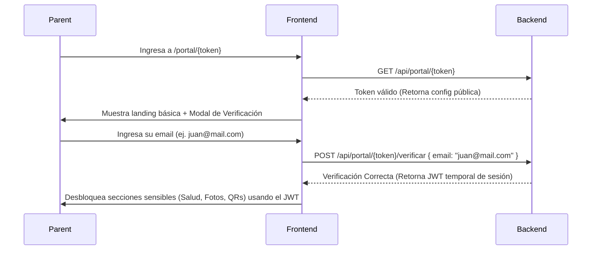

# Plan de Implementación: Portal del Participante (Dashboard de Padres)
### Eventia – Colonias Vacaciones / Casales

Este documento presenta el plan de desarrollo detallado para implementar el **Portal del Participante** (también referido como *Dashboard de Padres*), basado en las especificaciones del archivo `docx_extracted/dashboard.md` y adaptado al ecosistema actual de **Eventia**.

---

> [!IMPORTANT]
> El objetivo es proveer una interfaz pública móvil y de escritorio (**B2C**), accesible **sin registro ni credenciales** mediante un enlace tokenizado único (`token_consulta`), permitiendo a los tutores dar seguimiento en tiempo real al estado de la inscripción, saldos, QRs de retiros autorizados, incidentes médicos y la galería de fotos.

---

## 1. Arquitectura del Flujo

```mermaid
flowchart TD
    A[Padre hace clic en el enlace RSVP/Confirmación] --> B{Tiene token_consulta?}
    B -->|No| C[POST confirmar-inscripcion genera Token]
    B -->|Sí / Redirección| D[Acceso directo al portal]
    D --> E[GET /api/portal/{token}]
    E --> F{Detección del tipo de token}
    F -->|Programa| G[ArmarPortalProgramaAsync]
    F -->|Evento Privado| H[ArmarPortalEventoPrivadoAsync]
    F -->|Evento Público| I[ArmarPortalEventoPublicoAsync]
    G & H & I --> J[Mapear DTO Unificado]
    J --> K[Renderizar Secciones según Configuración]
```

---

## 2. Definición del Modelo de Datos (PostgreSQL)

Se implementarán dos tablas nuevas en la base de datos para habilitar la parametrización de secciones y la subida de fotos por evento.

### SQL - Secciones y Configuración
```sql
-- 1. Tabla de secciones del portal soportadas por el sistema
CREATE TABLE IF NOT EXISTS public.ef_param_portal_secciones (
    id_portal_seccion smallint GENERATED ALWAYS AS IDENTITY PRIMARY KEY,
    codigo varchar(60) NOT NULL,
    descripcion varchar(200) NULL,
    aplica_evento boolean NOT NULL DEFAULT true,
    aplica_programa boolean NOT NULL DEFAULT true,
    requiere_feature_codigo varchar(80) NULL,
    orden_default smallint NOT NULL DEFAULT 1,
    activo boolean NOT NULL DEFAULT true,
    fecha_alta timestamptz NOT NULL DEFAULT now(),
    fecha_modif timestamptz NULL
);

CREATE UNIQUE INDEX IF NOT EXISTS ux_param_portal_secciones_codigo 
ON public.ef_param_portal_secciones(codigo);

-- 2. Configuración de secciones por cada evento/programa
CREATE TABLE IF NOT EXISTS public.ef_evento_portal_config (
    id_evento_portal_config bigint GENERATED ALWAYS AS IDENTITY PRIMARY KEY,
    id_evento bigint NOT NULL,
    id_portal_seccion smallint NOT NULL,
    visible boolean NOT NULL DEFAULT true,
    orden smallint NOT NULL DEFAULT 1,
    titulo_override varchar(120) NULL,
    config_json jsonb NULL,
    activo boolean NOT NULL DEFAULT true,
    fecha_alta timestamptz NOT NULL DEFAULT now(),
    fecha_modif timestamptz NULL,

    CONSTRAINT fk_evento_portal_config_evento 
        FOREIGN KEY (id_evento) REFERENCES public.ef_eventos(id_evento) ON DELETE CASCADE,
    CONSTRAINT fk_evento_portal_config_seccion 
        FOREIGN KEY (id_portal_seccion) REFERENCES public.ef_param_portal_secciones(id_portal_seccion) ON DELETE RESTRICT
);

CREATE UNIQUE INDEX IF NOT EXISTS ux_evento_portal_config_evento_seccion 
ON public.ef_evento_portal_config(id_evento, id_portal_seccion);

-- 3. Tabla para fotos operativas publicadas por el organizador / staff
CREATE TABLE IF NOT EXISTS public.ef_evento_portal_fotos (
    id_portal_foto bigint GENERATED ALWAYS AS IDENTITY PRIMARY KEY,
    id_evento bigint NOT NULL,
    titulo varchar(120) NULL,
    descripcion varchar(300) NULL,
    url_foto varchar(600) NOT NULL,
    fecha_foto date NULL,
    visible_portal boolean NOT NULL DEFAULT true,
    activo boolean NOT NULL DEFAULT true,
    id_usuario_carga bigint NULL,
    fecha_alta timestamptz NOT NULL DEFAULT now(),
    fecha_modif timestamptz NULL,

    CONSTRAINT fk_evento_portal_fotos_evento 
        FOREIGN KEY (id_evento) REFERENCES public.ef_eventos(id_evento) ON DELETE CASCADE,
    CONSTRAINT fk_evento_portal_fotos_usuario 
        FOREIGN KEY (id_usuario_carga) REFERENCES public.ef_usuarios(id_usuario) ON DELETE SET NULL
);

CREATE INDEX IF NOT EXISTS ix_evento_portal_fotos_evento 
ON public.ef_evento_portal_fotos(id_evento, visible_portal, activo, fecha_foto);
```

### Datos Iniciales de Carga (Secciones Paramétricas)
```sql
INSERT INTO public.ef_param_portal_secciones 
(codigo, descripcion, aplica_evento, aplica_programa, requiere_feature_codigo, orden_default)
VALUES 
('RESUMEN', 'Resumen general del evento', true, true, null, 1),
('AGENDA', 'Agenda y cronograma', true, false, null, 2),
('PARTICIPANTES', 'Integrantes / Hijos inscriptos', true, true, null, 3),
('PAGOS', 'Detalle financiero y estado de cuenta', false, true, null, 4),
('QRS_RETIRO', 'QRs y pases de retiros autorizados', false, true, null, 5),
('RETIROS', 'Historial operativo de salidas', false, true, null, 6),
('SALUD', 'Ficha y alertas de salud', false, true, null, 7),
('SALUD_ACCIONES', 'Reportes médicos diarios', false, true, null, 8),
('AUTORIZACIONES', 'Control de firmas de consentimientos', false, true, null, 9),
('FOTOS', 'Galería de fotos oficial del staff', true, true, null, 10),
('NOVEDADES', 'Novedades y comunicados', true, true, 'NOVEDADES_EVENTO', 11)
ON CONFLICT (codigo) DO NOTHING;
```

---

## 3. Estructura de Archivos a Crear y Modificar

### Backend (.NET Core API) [COMPLETADO]
```
MODIFICAR
├── API/DataSchema/DataContext.cs                      ← Registrar DbSets de las nuevas entidades.
└── API/Controllers/Programas/programasController.cs    ← Confirmar retorno de "url_portal" al finalizar inscripciones.

CREAR
├── API/DataSchema/ef_param_portal_secciones.cs         ← Entity para catálogo de secciones.
├── API/DataSchema/ef_evento_portal_config.cs           ← Entity para configuración de visibilidad.
├── API/DataSchema/ef_evento_portal_fotos.cs            ← Entity para fotos operativas.
├── API/DataSchema/ModelConfiguration/...               ← Configuraciones FluentAPI para EF Core.
├── API/DataSchema/DTO/Portal/PortalPublicoDTO.cs       ← DTO unificado de respuesta.
└── API/Controllers/Portal/portalController.cs          ← Controlador de acceso público sin JWT.
```

### Frontend (Next.js)
```
CREAR
├── src/features/portal/
│   ├── types.ts                                       ← Definición de contratos y interfaces.
│   └── portal.service.ts                              ← Fetcher para traer portal con token.
│
├── src/app/api/portal/[token]/
│   └── route.ts                                       ← Proxy API Next.js (GET público).
│
└── src/app/portal/[token]/
    ├── page.tsx                                       ← Dashboard principal contenedor.
    └── components/                                    ← Paneles dinámicos por sección:
        ├── PortalResumen.tsx
        ├── PortalPagos.tsx
        ├── PortalQrRetiro.tsx
        ├── PortalRetirosHistorial.tsx
        ├── PortalSaludAlertas.tsx
        └── PortalGaleriaFotos.tsx
```

---

## 4. Seguridad, Cumplimiento Legal (GDPR / RGPD) y Doble Validación

Dado que el portal es de acceso público (sin login) y gestiona información altamente sensible de menores de edad (ficha médica, alertas de salud, fotos e historial de retiros), es imperativo cumplir con las normativas internacionales de protección de datos (como la **GDPR / RGPD** y la legislación local de protección de datos de menores).

Para mitigar riesgos por exposición o reenvío accidental de enlaces:

### A. Mecanismo de Doble Validación (Soft Verification por Email)
Al ingresar a `/portal/{token}`, el portal mostrará una vista básica no sensible (ej. mensaje de bienvenida y fechas generales del evento). Para desbloquear los paneles críticos (**Salud**, **QRs de Retiro** y **Galería de Fotos**), el padre deberá superar una validación secundaria:
- **Verificación por Email (Soft Verification)**: El usuario debe introducir el email del responsable de la inscripción. El backend compara esto (ignorando mayúsculas/minúsculas) contra `ef_programa_inscripciones.responsable_email`. Si coincide, se genera y devuelve un JWT temporal válido por 24 horas que habilita las secciones sensibles.



### B. Cumplimiento de Expiración (Derecho al Olvido y Limitación de Almacenamiento)
- **Expiración automática**: Los enlaces de consulta pública (`token_consulta`) se desactivarán en la base de datos de manera estricta **30 días después** de la fecha de finalización del evento (`ef_eventos.fecha_fin`).
- **Revocación manual (B2B)**: El organizador podrá, desde la interfaz de administración, invalidar un `token_consulta` actual y generar uno nuevo en caso de que el tutor reporte que el enlace se ha filtrado.
- **Políticas de consentimiento**: La visualización de fotos en el portal estará condicionada a que la autorización de derechos de imagen (`ef_autorizaciones` correspondiente al participante con código de sección `FOTOS`) haya sido aceptada y firmada de manera conforme.

---

## 5. Diseño de Componentes Frontend

Para asegurar la coherencia estética con el dashboard B2B existente (basado en Tailwind-like CSS y fuentes limpias):
- **Responsive-First**: El portal de los padres se usará un 90% en dispositivos móviles. Todo elemento interactivo tendrá un área táctil mínima de `44px x 44px`.
- **Badges Semánticos de Estados**:
  - Saldo en $0: `bg-emerald-500/10 text-emerald-400 border-emerald-500/20`
  - Con deuda pendiente: `bg-amber-500/10 text-amber-400 border-amber-500/20`
  - Retiro realizado hoy: `bg-slate-500/10 text-slate-400 line-through`
- **Animaciones Suaves**: Transiciones de `framer-motion` para los despliegues de acordeón de la ficha médica y carrusel móvil de fotos.

---

## 6. Integración Frontend (Contratos de Endpoints)

El frontend consumirá los siguientes endpoints expuestos por `portalController.cs`. A continuación se detalla qué debe enviar y qué recibirá.

### A. Endpoint de Inicio (Público)
**Ruta:** `GET /api/portal/{token_consulta}`

- **¿Qué envía el Frontend?**
  Solo el `token_consulta` proveniente de la URL como un parámetro de ruta. No requiere Headers de autenticación.
- **¿Qué recibe el Frontend?**
  Un objeto `PortalPublicoDTO` con información no sensible del evento y la configuración de las secciones habilitadas.
  ```json
  {
    "evento": {
      "nombre": "Colonia de Verano 2026",
      "fecha_inicio": "2026-12-01",
      "fecha_fin": "2026-12-31",
      "logo_url": null,
      "estado": "ACTIVO"
    },
    "participante": {
      "nombre_responsable": "Juan",
      "apellido_responsable": "Pérez"
    },
    "secciones_habilitadas": [
      { "codigo": "RESUMEN", "orden": 1, "titulo": "Resumen General" },
      { "codigo": "SALUD", "orden": 2, "titulo": "Ficha Médica" },
      { "codigo": "FOTOS", "orden": 3, "titulo": "Galería de Fotos" }
    ]
  }
  ```

### B. Endpoint de Verificación Suave (Soft Verification)
**Ruta:** `POST /api/portal/{token_consulta}/verificar`

Cuando el padre intente acceder a una sección sensible (como la Galería de Fotos o Salud), el frontend desplegará un prompt pidiendo su Email de acceso. 

- **¿Qué envía el Frontend?**
  Body (`PortalVerificarRequest`):
  ```json
  {
    "email": "juan.perez@example.com"
  }
  ```
- **Lógica Backend:** El backend comprueba si el `email` proporcionado coincide (ignorando mayúsculas y minúsculas) con el `responsable_email` de la inscripción mapeada por ese token.
- **¿Qué recibe el Frontend?**
  Body (`PortalVerificarResponse`):
  ```json
  {
    "token": "eyJhbGciOiJIUzI1NiIsInR5cCI6Ik..." // JWT Temporal de Sesión (Válido por 24 hs)
  }
  ```

### C. Endpoints Sensibles (Protegidos por el JWT Temporal)
**Rutas de ejemplo (A Desarrollar):** 
- `GET /api/portal/salud`
- `GET /api/portal/fotos`

- **¿Qué envía el Frontend?**
  Debe enviar en los Headers la autorización usando el Bearer Token obtenido en la verificación suave:
  `Authorization: Bearer <JWT_Temporal>`
- **¿Qué recibe el Frontend?**
  Listados detallados según la sección.

---

## 7. Estado de Implementación y Siguientes Pasos

1. **Fase de Base de Datos**: `[COMPLETADO]` Creación de tablas, DbSets e INSERT semilla en SQL.
2. **Fase de Backend API**: `[COMPLETADO]` Creación de entidades, DTOs y el `portalController.cs` con el mapeo y verificación por email.
3. **Fase de Integración en Inscripción**: `[COMPLETADO]` Se inyecta la URL del portal en `ProgramaInscripcionConfirmarResponse`.
4. **Fase Frontend**: `[PENDIENTE]` Construcción de la UI en Next.js (maquetación, estado de verificación, fetch de datos) basándose en los contratos definidos en el punto 6.
