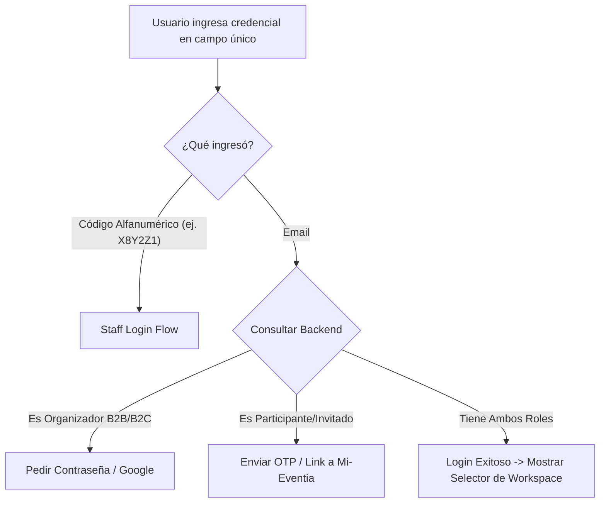

# Propuesta de Mejora de UX/UI: Unificación de Logins en Eventia

Actualmente, **Eventia** cuenta con tres flujos de acceso independientes, cada uno diseñado para un público objetivo y con métodos de autenticación diferentes. Si bien esto separa lógicamente las responsabilidades, genera fricción para el usuario final que llega a la página de inicio sin saber exactamente a dónde dirigirse.

A continuación se detalla el análisis de la situación actual y se proponen **tres soluciones de diseño y flujo** para mejorar la experiencia de usuario.

---

## 1. Diagnóstico de la Situación Actual

| Portal / Acceso | Ruta actual | Tipo de Usuario | Método de Autenticación |
| :--- | :--- | :--- | :--- |
| **Aplicativo Principal** | [`/login`](file:///c:/Users/jcgarcia/Desktop/Portfolio/Eventia/Eventia/CodigoFuente/antenas/FrontEnd/eventiaapp/src/app/(auth)/login/page.tsx) | Organizadores, Administradores y Cuentas B2B | Email + Contraseña o Google Sign-In |
| **Portal de Staff** | [`/staff/login`](file:///c:/Users/jcgarcia/Desktop/Portfolio/Eventia/Eventia/CodigoFuente/antenas/FrontEnd/eventiaapp/src/app/staff/login/page.tsx) | Coordinadores, Control de accesos y Acreditadores | Código alfanumérico (ej: `X8Y2Z1`) |
| **Mi-Eventia (Portal)** | [`/ingresar`](file:///c:/Users/jcgarcia/Desktop/Portfolio/Eventia/Eventia/CodigoFuente/antenas/FrontEnd/eventiaapp/src/app/ingresar/page.tsx) o `/portal/[token]` | Participantes, Invitados o Tutores responsables | Link único (Token) o Email + OTP (6 dígitos) |

### 🚨 Puntos de Dolor Identificados:
1. **Falta de descubribilidad**: El botón "Iniciar sesión" del Home lleva únicamente al aplicativo (`/login`). Si un miembro del Staff o un Invitado quiere ingresar desde la web principal, no tiene un botón o enlace para acceder a sus portales correspondientes.
2. **Fragmentación Visual**: Los tres logins se ven como aplicaciones separadas en lugar de un ecosistema unificado de Eventia.
3. **Confusión de Roles**: Un usuario que es Organizador pero a la vez es Staff o quiere ver su entrada como Invitado debe lidiar con tres sesiones y rutas completamente distintas.

---

## 2. Soluciones Propuestas

A continuación se presentan tres enfoques que van desde la optimización visual simple hasta la unificación inteligente.

### 💡 Opción A: Portal de Acceso Inteligente (Detección Dinámica)
*Esta es la opción premium y más automatizada.* Consiste en una única pantalla de login con un solo campo de texto que detecta automáticamente el tipo de entrada del usuario.



* **Cómo funciona:**
  1. El usuario accede a `/login` y ve un único campo: *"Ingresá tu email, código de staff o link"*.
  2. Si ingresa un código corto de 6 caracteres (ej. `A2B3C4`), el sistema infiere que es un miembro del **Staff** y procede con esa validación.
  3. Si ingresa un email, el sistema realiza una comprobación rápida en background:
     - Si solo es **Organizador**, muestra el campo de contraseña.
     - Si solo es **Invitado**, activa el flujo de OTP sin contraseña.
     - Si tiene **ambos roles**, tras autenticarse se le muestra un selector: *¿A qué panel deseas ingresar hoy? [Organizador] o [Mi-Eventia (Invitado)]*.
* **Pros:** 
  * UX de primer nivel (Zero-friction).
  * URL única para todo el ecosistema.
  * Oculta la complejidad técnica del backend al usuario.
* **Cons:** Requiere cambios en los endpoints del backend para consultar roles antes/durante el proceso de login.

---

### 🎨 Opción B: Panel Unificado con Pestañas (Tabbed Gateway)
*Recomendada como "Quick Win" por su alta viabilidad técnica a corto plazo.* Mantiene los servicios de backend idénticos, pero centraliza visualmente los tres accesos en una sola interfaz modular.

```carousel
```
```html
<!-- Ejemplo visual del Selector en /login -->
<div class="flex border-b border-gray-700">
  <button class="flex-1 py-3 text-white font-bold border-b-2 border-indigo-500">Organizador</button>
  <button class="flex-1 py-3 text-neutral-400 font-medium">Personal Staff</button>
  <button class="flex-1 py-3 text-neutral-400 font-medium">Invitado (Mi-Eventia)</button>
</div>
```
<!-- slide -->
```markdown
### Detalle de Pestañas:
1. **Pestaña Organizador:** Muestra el login tradicional con Email, Contraseña y Google.
2. **Pestaña Personal Staff:** Muestra el input grande para el código de acceso alfanumérico (muda el flujo de `/staff/login` aquí).
3. **Pestaña Invitado:** Muestra el input de email para enviar el enlace o código OTP de acceso a Mi-Eventia (muda el flujo de `/ingresar` aquí).
```
````

* **Cómo funciona:**
  * Al ingresar a `/login`, se presenta una tarjeta de login moderna.
  * En la parte superior, tiene pestañas (Tabs) o tarjetas de rol (*Organizador / Staff / Invitado*).
  * El usuario selecciona su rol y la tarjeta cambia de forma interactiva y con transiciones suaves para mostrar el formulario correspondiente.
* **Pros:**
  * Muy fácil de implementar (se puede hacer 100% en Frontend reutilizando los servicios actuales).
  * Evita la confusión y educa al usuario sobre los distintos roles del sistema.
  * Centraliza todo en `/login`.
* **Cons:** Requiere que el usuario haga un clic inicial para seleccionar su pestaña si no es la seleccionada por defecto (Organizador).

---

### 🔑 Opción C: Autenticación Passwordless Universal (Magic Link / OTP para todos)
*Unificación bajo el estándar moderno de seguridad sin contraseñas.*

* **Cómo funciona:**
  * Se elimina el uso de contraseñas tradicionales para todos los usuarios.
  * El login es siempre por email. El usuario ingresa su email en `/login` y recibe un código OTP de 6 dígitos (por correo o WhatsApp) o un link mágico.
  * Al validar el código, el sistema detecta qué permisos y cuentas tiene vinculadas a ese email y le da acceso a su respectivo panel.
  * Para Staff de campo que usa terminales rápidas, se puede permitir un acceso secundario rápido mediante el código alfanumérico clásico.
* **Pros:** 
  * Seguridad máxima contra robos de contraseña.
  * Simplicidad absoluta.
* **Cons:** Mayor dependencia de servicios de envío de emails/WhatsApp (costos) y posible fricción si el usuario no tiene acceso rápido a su bandeja de entrada en ese instante.

---

## 3. Plan de Acción Recomendado

Para lograr el mayor impacto de UX con el menor esfuerzo de desarrollo inicial, sugerimos avanzar en dos etapas:

### 🚀 Fase 1: Implementar la Opción B (Panel Unificado en Frontend)
1. **Modificar la ruta `/login`** para que sea el portal de acceso global.
2. Diseñar un selector de pestañas moderno (Premium: usando Tailwind/Vanilla CSS con efectos de *glassmorphism*, gradientes suaves e íconos dinámicos).
3. Integrar los componentes de:
   * Login de aplicativo [`LoginForm`](file:///c:/Users/jcgarcia/Desktop/Portfolio/Eventia/Eventia/CodigoFuente/antenas/FrontEnd/eventiaapp/src/app/(auth)/login/page.tsx)
   * Login de staff [`StaffLoginPage`](file:///c:/Users/jcgarcia/Desktop/Portfolio/Eventia/Eventia/CodigoFuente/antenas/FrontEnd/eventiaapp/src/app/staff/login/page.tsx)
   * Login de participante/recuperación [`FormularioRecuperacion`](file:///c:/Users/jcgarcia/Desktop/Portfolio/Eventia/Eventia/CodigoFuente/antenas/FrontEnd/eventiaapp/src/app/ingresar/page.tsx)
4. Redirigir antiguas rutas (`/staff/login` y `/ingresar`) hacia `/login` con un parámetro query (ej: `/login?role=staff` o `/login?role=guest`) para abrir la pestaña correcta automáticamente si vienen desde un link directo.

### ⚙️ Fase 2: Evolución hacia la Opción A (Identificación Inteligente)
* A medida que se consolide el backend, unificar los endpoints de consulta de usuarios para que el frontend pueda detectar la identidad del usuario en tiempo real al escribir su email/código sin requerir pestañas manuales.
